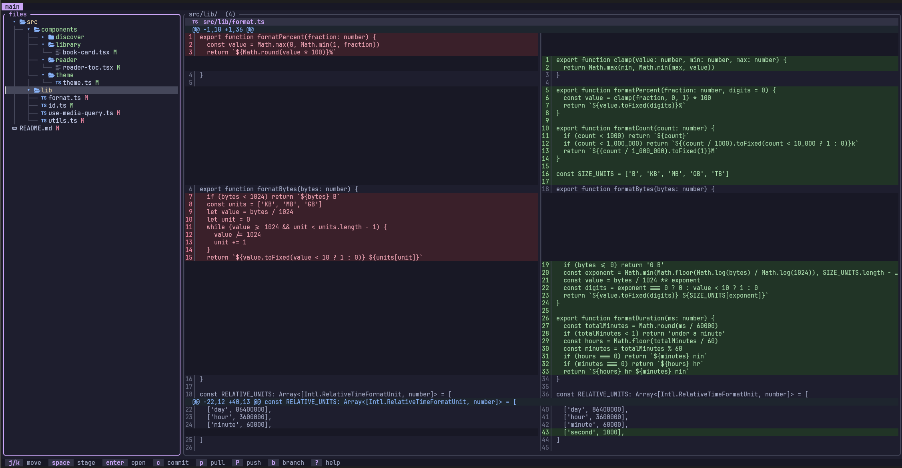

# laziergit

an even lazier git implementation than lazygit



## install

```
cargo install laziergit
```

## usage

run `laziergit` inside a git repo.

keys: `j`/`k` move, `h`/`l` fold, `enter` open, `space` stage, `c` commit, `p`/`P` pull/push, `b` branch, `X` discard all, `?` help, `q` quit
